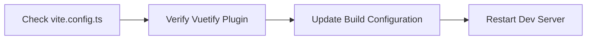
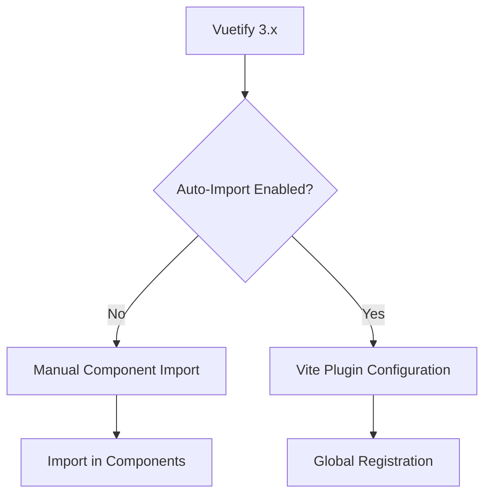
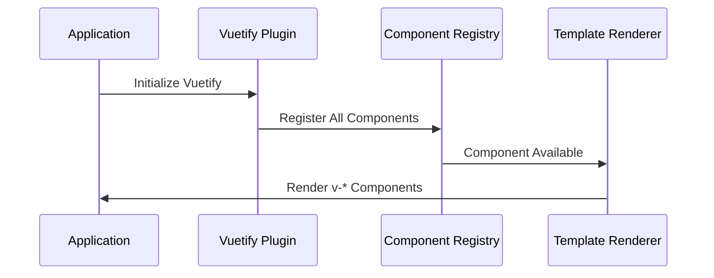
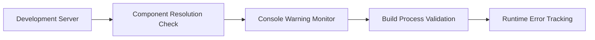

# Frontend Component Errors - Vuetify Resolution Issues

## Overview

The frontend application is experiencing Vue component resolution errors related to Vuetify components. All Vuetify components (`v-navigation-drawer`, `v-app-bar`, `v-container`, `v-main`, `v-app`, `v-icon`, `v-btn`, `v-list-item`, `v-divider`, `v-list-group`) are failing to resolve and being treated as native custom elements.

## Problem Analysis

### Root Cause

The issue stems from incorrect Vuetify plugin initialization or missing component imports. The error pattern indicates that Vue cannot locate the Vuetify components in its component registry.

### Error Symptoms

```
[Vue warn]: Failed to resolve component: v-navigation-drawer
[Vue warn]: Failed to resolve component: v-app-bar
[Vue warn]: Failed to resolve component: v-container
[Vue warn]: Failed to resolve component: v-main
[Vue warn]: Failed to resolve component: v-app
[Vue warn]: Failed to resolve component: v-icon
[Vue warn]: Failed to resolve component: v-btn
[Vue warn]: Failed to resolve component: v-list-item
[Vue warn]: Failed to resolve component: v-divider
[Vue warn]: Failed to resolve component: v-list-group
```

### Impact Assessment

- Complete UI framework failure
- Non-functional user interface
- Layout components not rendering
- Navigation system broken
- All interactive elements unavailable

## Current Configuration Analysis

### Plugin Registration Status

```mermaid
graph TD
    A[main.ts] --> B[Import Vuetify Plugin]
    B --> C[Register with app.use()]
    C --> D[Mount Application]

    E[vuetify.ts] --> F[createVuetify()]
    F --> G[Theme Configuration]
    F --> H[Icon Configuration]
    F --> I[Component Defaults]

    B -.-> E

    style A fill:#e1f5fe
    style E fill:#fff3e0
    style D fill:#e8f5e8
```

### Dependencies Analysis

| Package | Version | Status | Purpose |
|---------|---------|--------|---------|
| vuetify | ^3.9.5 | ✅ Installed | Core UI Framework |
| @mdi/font | ^7.4.47 | ✅ Installed | Material Design Icons |
| vue | ^3.5.19 | ✅ Installed | Frontend Framework |

## Potential Issues & Solutions

### Issue 1: Build Tool Configuration

**Problem**: Vite may not be properly configured to handle Vuetify's component auto-importing or CSS processing.

**Solution Strategy**:


### Issue 2: CSS Import Order

**Problem**: Vuetify styles may not be loading correctly, causing component definitions to be missing.

**Solution Strategy**:
- Verify CSS import order in `vuetify.ts`
- Ensure `vuetify/styles` is imported before component usage
- Check for conflicting global styles

### Issue 3: Plugin Initialization Timing

**Problem**: Vuetify plugin may not be properly initialized before component rendering.

**Solution Strategy**:
- Verify plugin registration order in `main.ts`
- Ensure Vuetify is registered before router
- Check for async plugin loading issues

### Issue 4: Component Auto-Import Configuration

**Problem**: Vuetify 3.x may require explicit component imports or auto-import configuration.

**Solution Strategy**:


## Recommended Fix Sequence

### Phase 1: Configuration Verification

1. **Vite Configuration Check**
   - Verify `vite.config.ts` includes Vuetify plugin
   - Ensure proper CSS processing configuration
   - Check for conflicting plugins

2. **Plugin Registration Verification**
   - Confirm Vuetify plugin import path
   - Verify plugin registration order
   - Check for plugin initialization errors

### Phase 2: Dependency Resolution

1. **Clean Installation**
   - Remove `node_modules` and `package-lock.json`
   - Reinstall dependencies with `npm install`
   - Verify Vuetify version compatibility

2. **Build Cache Clearing**
   - Clear Vite build cache
   - Restart development server
   - Check browser cache

### Phase 3: Component Import Strategy

1. **Auto-Import Configuration**
   - Configure Vite plugin for Vuetify auto-imports
   - Enable tree-shaking for optimal bundle size
   - Test component resolution

2. **Manual Import Fallback**
   - Implement explicit component imports if auto-import fails
   - Create component registration utilities
   - Update component usage patterns

## Vite Configuration Requirements

```typescript
// vite.config.ts structure needed
export default defineConfig({
  plugins: [
    vue(),
    vuetify({
      theme: {
        defaultTheme: 'light'
      }
    })
  ],
  css: {
    preprocessorOptions: {
      scss: {
        api: 'modern-compiler'
      }
    }
  }
})
```

## Component Registration Patterns

### Global Registration Approach



### On-Demand Import Approach

```typescript
// Alternative component import strategy
import {
  VApp,
  VNavigationDrawer,
  VAppBar,
  VMain,
  VContainer
} from 'vuetify/components'

// Register specific components
app.component('VApp', VApp)
app.component('VNavigationDrawer', VNavigationDrawer)
// ... other components
```

## Testing Strategy

### Verification Steps

1. **Component Resolution Test**
   - Create minimal test component
   - Use single Vuetify component
   - Verify successful rendering

2. **Plugin Functionality Test**
   - Test theme switching
   - Verify icon rendering
   - Check responsive behavior

3. **Build Process Test**
   - Run production build
   - Verify no build errors
   - Test in production mode

### Success Criteria

- [ ] All Vuetify components resolve without warnings
- [ ] UI renders correctly with expected styling
- [ ] Navigation functionality works
- [ ] Theme switching operational
- [ ] Icons display properly
- [ ] Responsive layout functions
- [ ] No console errors or warnings

## Monitoring & Prevention

### Error Detection



### Preventive Measures

1. **Dependency Lock Files**
   - Maintain `package-lock.json` integrity
   - Use exact version pinning for critical dependencies
   - Regular dependency audits

2. **Configuration Validation**
   - Automated vite config validation
   - Plugin compatibility checks
   - Build process monitoring

3. **Development Workflow**
   - Pre-commit hook for build verification
   - Automated component resolution testing
   - CI/CD pipeline with UI testing

## Implementation Priority

| Priority | Task | Estimated Effort | Impact |
|----------|------|------------------|--------|
| P0 | Fix Vite configuration | 30 min | Critical |
| P0 | Verify plugin registration | 15 min | Critical |
| P1 | Clean dependency installation | 20 min | High |
| P1 | Test component resolution | 45 min | High |
| P2 | Implement monitoring | 60 min | Medium |
| P3 | Documentation update | 30 min | Low |
