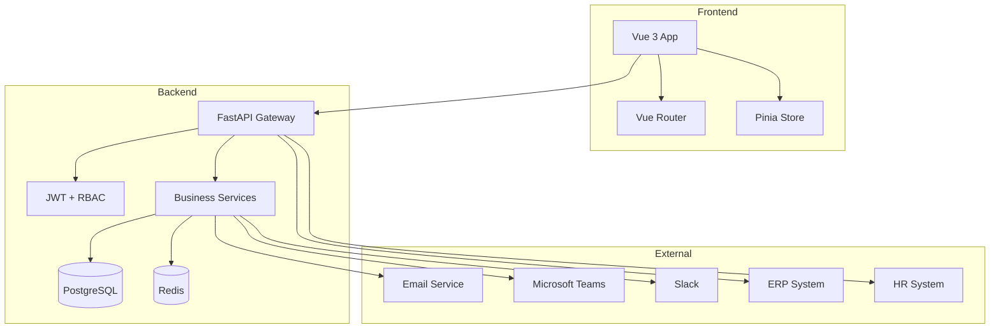
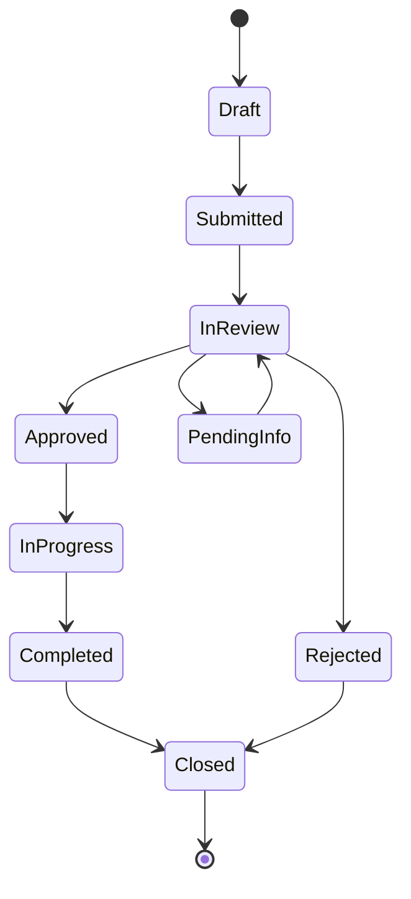
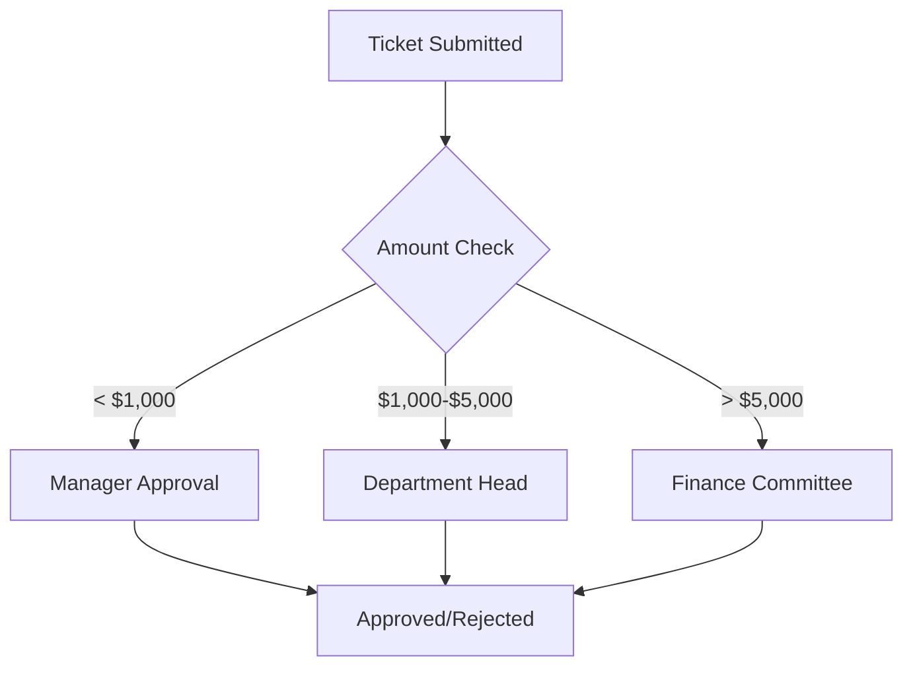
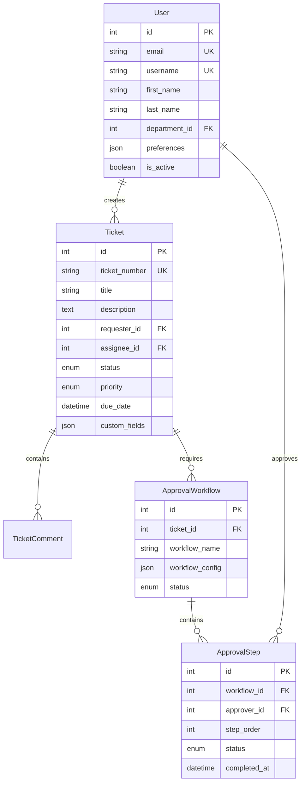
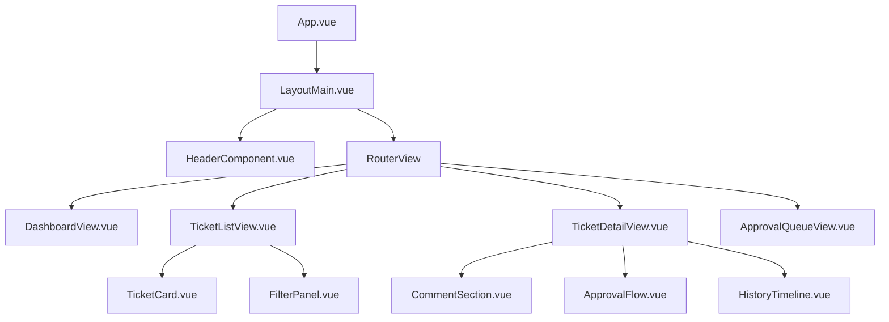
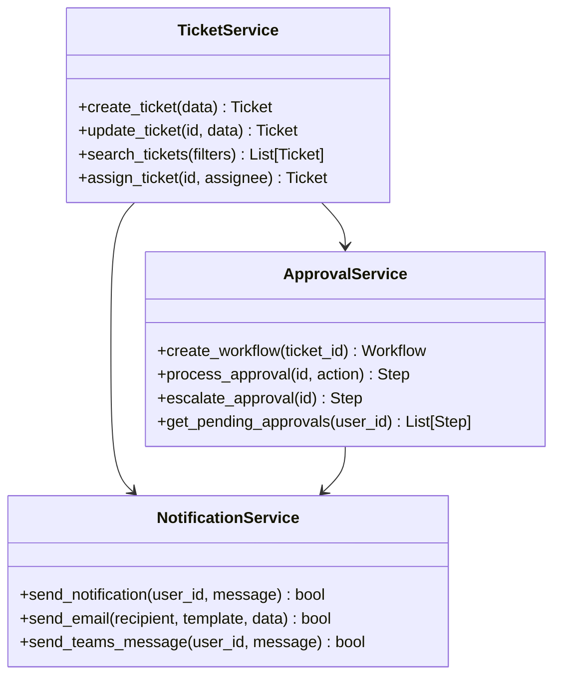

# Enterprise Internal Ticket Management System Design

## Overview

The Enterprise Internal Ticket Management System provides centralized request tracking, issue reporting, and approval workflow management. Built on the existing FastAPI + Vue 3 architecture, it supports 1000+ concurrent users with enterprise-grade security and integration capabilities.

### System Objectives
- Centralized request management across all departments
- Automated multi-level approval workflows
- Real-time notifications via Email, Teams, and Slack
- Enterprise integration with ERP and HR systems
- Comprehensive audit trail and reporting

### Target Users
- **General Employees**: Ticket creation and tracking
- **Department Managers**: Approval workflows and oversight
- **System Administrators**: Platform configuration
- **IT Support**: Technical issue resolution
- **Executive Management**: Analytics and reporting

## Architecture

### Technology Stack

**Backend**: FastAPI + SQLAlchemy + PostgreSQL + Redis + Celery
**Frontend**: Vue 3 + TypeScript + Pinia + Vue Router
**External**: SMTP, Microsoft Graph API, Slack API

### System Architecture



## Functional Requirements

### Core Features

#### 1. Ticket Management
- **Ticket Types**: IT Support, HR, Finance, Facility, Custom
- **Properties**: Unique ID, Priority, Category, Due Date, Attachments
- **Status Flow**: Draft → Submitted → In Review → Approved/Rejected → Completed → Closed



#### 2. Approval Workflows
- **Types**: Sequential, Parallel, Conditional, Escalation
- **Actions**: Approve, Reject, Request Info, Delegate, Escalate
- **Configuration**: Rule-based routing by amount, department, type



#### 3. Notification System
- **Channels**: In-app, Email, Teams, Slack, SMS
- **Events**: Submission, Assignment, Approval, Status Change, Escalation
- **Templates**: Customizable notification templates

#### 4. Search & Reporting
- **Search**: Full-text search, advanced filtering, saved queries
- **Reports**: Standard dashboards, custom reports, scheduled exports
- **Analytics**: SLA compliance, performance metrics, trend analysis

## Data Models

### Core Schema



### Extended Models

#### Ticket Model
```python
class Ticket(Base):
    __tablename__ = "tickets"

    id = Column(Integer, primary_key=True, index=True)
    ticket_number = Column(String, unique=True, index=True)
    title = Column(String, nullable=False)
    description = Column(Text)
    requester_id = Column(Integer, ForeignKey("users.id"))
    assignee_id = Column(Integer, ForeignKey("users.id"))
    status = Column(Enum(TicketStatus), default=TicketStatus.DRAFT)
    priority = Column(Enum(Priority), default=Priority.MEDIUM)
    due_date = Column(DateTime(timezone=True))
    custom_fields = Column(JSON)
    created_at = Column(DateTime(timezone=True), server_default=func.now())
    updated_at = Column(DateTime(timezone=True), onupdate=func.now())
```

## API Design

### Core Endpoints

| Method | Endpoint | Description |
|--------|----------|-------------|
| POST | `/api/v1/auth/login` | User authentication |
| GET | `/api/v1/tickets` | List tickets with filters |
| POST | `/api/v1/tickets` | Create new ticket |
| GET | `/api/v1/tickets/{id}` | Get ticket details |
| PUT | `/api/v1/tickets/{id}` | Update ticket |
| POST | `/api/v1/tickets/{id}/comments` | Add comment |
| GET | `/api/v1/approvals/pending` | Get pending approvals |
| POST | `/api/v1/approvals/{id}/approve` | Approve request |
| POST | `/api/v1/approvals/{id}/reject` | Reject request |
| GET | `/api/v1/reports/dashboard` | Dashboard metrics |

### Request/Response Schema

#### Ticket Creation
```json
{
  "title": "New Laptop Request",
  "description": "Need laptop for project work",
  "ticket_type": "IT_HARDWARE",
  "priority": "MEDIUM",
  "due_date": "2024-01-15T00:00:00Z",
  "custom_fields": {
    "budget_code": "PROJ001",
    "justification": "Current laptop insufficient"
  }
}
```

#### Approval Action
```json
{
  "action": "APPROVE",
  "comments": "Approved for project requirements",
  "delegate_to": null
}
```

## Component Architecture

### Frontend Components



### Business Logic Layer



## User Scenarios

### Scenario 1: Employee IT Request
**User**: Marketing Specialist Jane needs new laptop
**Flow**:
1. Login via SSO → Select IT Support → Fill form → Upload justification
2. Auto-route to manager → Email notification → One-click approval
3. IT assignment → Procurement → Delivery → Closure

**Expected**: Ticket ID generated, SLA applied, real-time updates, audit trail

### Scenario 2: Manager Bulk Approvals
**User**: Department Head Mike reviews 12 pending approvals
**Flow**:
1. Dashboard shows pending count → Approval queue sorted by urgency
2. Bulk approve 8 routine → Individual review 3 high-value → Request info 1
3. Mobile quick-approvals → Delegate authority for next week

**Expected**: Mobile-responsive interface, bulk actions, delegation settings

### Scenario 3: Emergency Processing
**User**: Critical server outage requires emergency approval
**Flow**:
1. IT creates critical ticket → Auto-escalation → Multi-channel notifications
2. Manager SMS alert → Mobile biometric approval → 15-min escalation timer
3. Expedited processing → Vendor notification → Real-time tracking

**Expected**: Emergency workflows, sub-minute tracking, automated documentation

## Non-Functional Requirements

### Performance
- **Concurrent Users**: 1000+ simultaneous users
- **Response Time**: < 200ms API responses
- **Database**: Optimized queries with indexing
- **Caching**: Redis for sessions and frequent data

### Security
- **Authentication**: SSO (SAML/OAuth), MFA support
- **Authorization**: RBAC with granular permissions
- **Data Protection**: Encryption at rest/transit, audit logging
- **API Security**: Rate limiting, input validation, HTTPS

### Integration
- **ERP/HR Systems**: RESTful connectors, real-time sync
- **External APIs**: Robust error handling, retry mechanisms
- **Data Mapping**: Transformation layer for system integration

## Testing Strategy

### Unit Testing
- **Backend**: 80% code coverage, service layer testing
- **Frontend**: Component testing, user interaction testing
- **API**: Endpoint validation, authentication flow testing

### Integration Testing
- **End-to-End**: Complete user journey testing
- **Performance**: Load testing with 1000+ concurrent users
- **Security**: OWASP Top 10 vulnerability assessment

## Acceptance Criteria

### Functional
- [ ] Ticket creation with attachments up to 25MB
- [ ] Real-time status updates across interfaces
- [ ] Sub-2-second search response times
- [ ] Bulk operations for 100+ tickets
- [ ] Mobile-responsive design (320px-2560px)

### Performance
- [ ] 1000 concurrent users with <10% degradation
- [ ] 95% of database queries under 100ms
- [ ] 99.5% uptime during business hours
- [ ] 30-second failover for system redundancy

### Security
- [ ] SSO integration with SAML 2.0/OAuth 2.0
- [ ] MFA enrollment under 60 seconds
- [ ] Role-based permissions at API/UI levels
- [ ] Audit trail for all user actions
- [ ] Data encryption compliance standards
